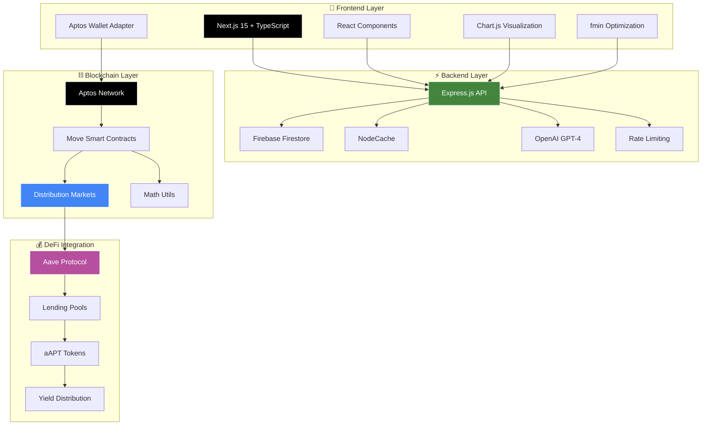

# Infi Markets - Distribution Markets Platform

<div align="center">


**A revolutionary prediction market platform for continuous probability distributions on Aptos blockchain**

[](https://opensource.org/licenses/MIT)
[](https://github.com/aryanbaranwal001/aptos_distribution_markets)
[](https://github.com/aryanbaranwal001/aptos_distribution_markets)
[](https://github.com/aryanbaranwal001/aptos_distribution_markets/pulls)

### 🛠️ **Tech Stack**


### 🔗 **DeFi Integrations**


---

</div>

## 🚀 Live Demo

<div align="center">

### **Experience Infi Markets in Action**

[](https://aptos-distribution-markets.vercel.app/)

**🔗 [https://aptos-distribution-markets.vercel.app/](https://aptos-distribution-markets.vercel.app/)**

---

</div>

## 🌟 Overview

Infi Markets is a cutting-edge decentralized prediction market platform that enables trading on **continuous probability distributions** rather than traditional binary outcomes. Built on the Aptos blockchain using Move smart contracts, it implements the concept of distribution markets based on research from [Paradigm's Distribution Markets paper](https://www.paradigm.xyz/2024/12/distribution-markets).

### 🎯 Key Innovation

Instead of betting on simple yes/no outcomes, traders can express nuanced beliefs about **where** and **how likely** different outcomes are across infinite ranges using different distributions - Normal distribution for now.

**Example**: Rather than betting "Will Bitcoin be above $100k?", you can bet "Bitcoin will be around $95k with high confidence, but could range from $80k-$110k"

## 🏗️ System Architecture

<div align="center">



</div>

### **🔄 Data Flow Architecture**

```
┌─────────────────┐    ┌──────────────────┐    ┌─────────────────┐    ┌─────────────────┐
│   Next.js       │    │   Express.js     │    │   Aptos         │    │   Aave          │
│   Frontend      │◄──►│   Backend API    │    │   Blockchain    │◄──►│   Protocol      │
│                 │    │                  │    │                 │    │                 │
│ • React/TS      │    │ • Firebase       │    │ • Move Contracts│    │ • Lending Pool  │
│ • Wallet Adapter│    │ • seed scripts   │    │ • Math Utils    │    │ • aAPT Tokens   │
│ • Chart.js      │    │ • Rate Limiting  │    │ • Settlement    │    │ • Yield Farming │
│ • fmin Optimize │    │ • AI Assistant   │    │ • Aave Bridge   │    │ • Auto Lending  │
└─────────────────┘    └──────────────────┘    └─────────────────┘    └─────────────────┘
```

### 🔄 **Data Flow**

1. **User Interaction** → User inputs distribution parameters (mean and standard deviation) through frontend and trade cost is calculated
2. **Transaction Signing** → Aptos Wallet Adapter handles secure transaction signing  
3. **Smart Contract Execution** → Move contracts process trades with 18-decimal precision and update market state
4. **Yield Optimization** → Idle collateral automatically lent to Aave earning ~4% APY for position holders
5. **Real-time Updates** → Backend API provides fast market data from firebase firestore and also enable AI assistance.

## 🚀 Features

### 📈 **Advanced Trading**
- **Continuous Distributions**: Trade on normal distributions with custom mean (μ) and standard deviation (σ)
- **Dynamic Pricing**: Real-time cost calculation using mathematical optimization (fmin library) and verified on-chain
- **Automated Market Maker**: Constant product AMM with distribution-based invariants
- **Position Settlement**: Mathematically precise payouts based on realized outcomes
- **Multi-Position Support**: Multiple concurrent positions per trader with pagination

### 💰 **Yield Optimization**
- **Aave Integration**: Idle collateral is automatically lent on Aave protocol earning ~4% APY
- **APY Distribution**: Lending yields are distributed proportionally to all position holders
- **Capital Efficiency**: Maximizes returns on locked collateral during entire market lifecycle
- **Risk Management**: Automated withdrawal system for settlements while maintaining full solvency

### 🎨 **Modern Interface**
- **Interactive Charts**: Real-time probability distribution visualization with Chart.js
- **Responsive Design**: Dynamic and user-friendly UI with multi-colour theme switching
- **Wallet Integration**: Seamless Aptos wallet connectivity with multiple wallet support
- **AI Assistant**: Built-in OpenRouter's `deepseek/deepseek-chat-v3.1:free` chat helper for market analysis and guidance
- **Real-time Updates**: Live cost calculation as users adjust distribution parameters

### 🔧 **Developer Features**
- **Mathematical Library implementation**: complex computational heavy functions in move language
- **Mathematical Precision**: 18-decimal fixed-point arithmetic for accurate calculations
- **Gas Optimization**: Efficient Move smart contracts with minimal transaction costs
- **Comprehensive Testing**: Full test suite with indepth testing
- **API Documentation**: RESTful backend with Firebase integration
- **Type Safety**: Full TypeScript implementation in frontend and Javascript in backend


## 📁 Project Structure

```
aptos_distribution_markets/
├── 📁 contracts/              # Move smart contracts
│   ├── sources/
│   │   ├── distribution_markets.move  # Core trading logic
│   │   └── math_utils.move           # Mathematical utilities
│   └── tests/                        # Contract tests
├── 📁 frontend/               # Next.js web application
│   ├── src/
│   │   ├── components/              # React components
│   │   ├── hooks/                   # Custom React hooks
│   │   ├── services/                # API services
│   │   └── utils/                   # Utility functions
│   └── public/                      # Static assets
├── 📁 backend/                # Express.js API server
│   ├── src/
│   │   ├── controllers/             # Route handlers
│   │   ├── services/                # Business logic
│   │   └── middleware/              # Express middleware
│   └── scripts/                     # Database utilities
└── 📄 firebase.md            # Firebase integration docs
```

## 🛠️ Technology Stack

<div align="center">

### **🔗 Blockchain Infrastructure**

| Technology | Version | Purpose | Performance |
|------------|---------|---------|-------------|
|  | Testnet | Layer 1 Blockchain | 160k+ TPS |
|  | Latest | Smart Contracts | Gas Optimized |

### **⚡ Backend Infrastructure**

| Technology | Version | Purpose | Performance |
|------------|---------|---------|-------------|
|  | 18+ | Runtime Environment | High Concurrency |
|  | 4.x | API Framework | <50ms Response |
|  | 12.x | Database & Auth | 99.9% Uptime |
|  | deepseek-chat-v3.1 | AI Assistant | Real-time Chat |


### **🎨 Frontend Stack**

| Technology | Version | Purpose | Performance |
|------------|---------|---------|-------------|
|  | 15.x | React Framework | SSR + ISR |
|  | 19.x | UI Library | Virtual DOM |
|  | 5.x | Type Safety | 100% Coverage |
|  | 4.x | Styling | JIT Compilation |
|  | 4.x | Data Visualization | 60fps Rendering |

### **🔧 Optimization & Utils**

| Technology | Version | Purpose | Performance |
|------------|---------|---------|-------------|
|  | 0.0.4 | Mathematical Optimization | <1ms Calculation |
|  | 5.x | State Management | Lightweight |
|  | 9.x | Code Quality | Zero Errors |

### **💰 DeFi Integrations**

| Protocol | Integration | Current APY | Status |
|----------|-------------|-------------|--------|
|  | Lending Pools | ~4% | ✅ Live |


</div>

## 🎨 Frontend Architecture

### **Component Structure**
```
src/
├── 📁 components/
│   ├── DemoMarketInstance.tsx    # Main trading interface
│   ├── NormalDistributionChart.tsx # Interactive probability charts
│   ├── WalletSelector.tsx        # Multi-wallet connection
│   ├── AIChatSidebar.tsx        # GPT-powered assistant
│   ├── Navbar.tsx               # Navigation with theme switching
│   └── ThemeProvider.tsx        # Global theme management
├── 📁 hooks/
│   ├── useMarkets.ts            # Market data fetching
│   ├── useWallet.ts             # Wallet state management
│   └── useTheme.ts              # Theme persistence
├── 📁 services/
│   └── apiService.ts            # Backend API integration
├── 📁 store/
│   ├── themeStore.ts            # Zustand theme store
│   └── marketStore.ts           # Market state management
└── 📁 utils/
    ├── formatters.ts            # Data formatting utilities
    ├── calculations.ts          # Mathematical helpers
    └── bookmarkStorage.ts       # Local storage management
```

### **Key Frontend Features**

#### **🎯 Trading Interface**
- **Real-time Cost Calculation**: Uses fmin optimization to calculate minimum trade cost
- **Interactive Sliders**: Smooth μ (mean) and σ (standard deviation) adjustment
- **Live Preview**: Instant visualization of proposed vs market distributions
- **Position Management**: View, track, and close multiple positions

#### **📊 Visualization**
- **Chart.js Integration**: High-performance probability distribution rendering
- **Responsive Charts**: Mobile-optimized with touch interactions
- **Real-time Updates**: Charts update as users adjust parameters
- **Statistical Overlays**: Probability, cumulative distribution, and delta values

#### **🤖 AI Assistant**
- **Deepseek chat V3 Integration**: Contextual market analysis and trading advice
- **Market Context**: AI understands specific market parameters and history
- **Educational Support**: Explains complex mathematical concepts
- **Risk Assessment**: Provides insights on position sizing and market dynamics

## 🔧 Backend Architecture

### **API Structure**
```
src/
├── 📁 controllers/
│   ├── marketController.js      # Market CRUD operations
│   ├── chatController.js        # AI assistant endpoints
│   └── healthController.js      # System health checks
├── 📁 services/
│   ├── firebaseService.js       # Firestore operations
│   ├── cacheService.js          # In-memory caching
│   └── openaiService.js         # GPT integration
├── 📁 middleware/
│   ├── rateLimiter.js           # API rate limiting
│   ├── validator.js             # Request validation
│   └── errorHandler.js          # Global error handling
├── 📁 routes/
│   ├── markets.js               # Market endpoints
│   ├── chat.js                  # AI chat endpoints
│   └── health.js                # Health check routes
└── 📁 config/
    └── firebase.js              # Firebase configuration
```

### **🔐 Security Features**
- **Firebase Admin SDK**: Secure server-side Firebase access
- **Input Validation**: Joi schema validation for all endpoints
- **Rate Limiting**: Per-IP request throttling
- **Error Sanitization**: Secure error messages without sensitive data
- **CORS Configuration**: Proper cross-origin resource sharing setup

## 🚀 Quick Start


### **📋 Prerequisites**

| Requirement | Version | Installation |
|-------------|---------|--------------|
|  | 18+ | [Download](https://nodejs.org/) |
|  | Latest | [Install Guide](https://aptos.dev/tools/aptos-cli/install-cli/) |
|  | 2.x | [Download](https://git-scm.com/) |

### **🔧 Installation Steps**

<details>
<summary><b>📦 1. Clone & Setup Repository</b></summary>

```bash
# Clone the repository
git clone https://github.com/aryanbaranwal001/aptos_distribution_markets.git
cd aptos_distribution_markets

# Install dependencies for all modules
npm install
```

</details>

<details>
<summary><b>⛓️ 2. Deploy Smart Contracts</b></summary>

```bash
cd contracts

# Compile Move contracts
aptos move compile --dev

# Deploy to testnet
aptos move publish --profile default --assume-yes

# Verify deployment
aptos account list --profile default
```

</details>

<details>
<summary><b>🔧 3. Configure Backend</b></summary>

```bash
cd backend

# Install dependencies
npm install

# Setup environment
cp .env.example .env

# Configure Firebase credentials
# Add your Firebase service account key to .env

# Start development server
npm run dev
```

</details>

<details>
<summary><b>🎨 4. Launch Frontend</b></summary>

```bash
cd frontend

# Install dependencies
npm install

cp .env.example .env.local

# Configure NEXT_PUBLIC_API_BASE_URL

# Start development server
npm run dev
```

</details>

## 🧮 Mathematical Foundation

### Core Formula
The platform implements the cost function:

```
a(x) = |λ_g × g(x) - λ_f × f(x)|
```

Where:
- **g(x)**: Trader's proposed distribution
- **f(x)**: Current market distribution  
- **λ**: Scaling factor = √(2σ√π)
- **x**: Outcome value

### Settlement Calculation
```
Settlement = λ_g × g(x₀) - λ_f × f(x₀) + collateral
```

Where **x₀** is the realized outcome.

### Key Properties
- **18-decimal precision**: Prevents rounding errors
- **Optimization-based pricing**: Uses fmin library for cost minimization
- **Mathematical soundness**: Based on peer-reviewed research

## 📊 Smart Contract Details

### Core Functions

| Function | Description | Parameters |
|----------|-------------|------------|
| `initialize_market()` | Create new prediction market | `initial_params`, `backing`, `asset` |
| `trade_with_apt()` | Execute distribution trade | `target_mean`, `target_std_dev`, `trade_cost` |
| `add_liquidity()` | Provide market liquidity | `apt_amount` |
| `resolve()` | Set market outcome | `realized_outcome` |
| `close_position()` | Claim settlement | `position_index` |
| `lend_to_aave()` | Lend idle collateral to Aave | `amount` |
| `withdraw_from_aave()` | Withdraw from Aave for settlements | `amount` |
| `distribute_yield()` | Distribute Aave yields to positions | `yield_amount` |

### 💰 Aave Integration 

#### **Capital Efficiency Benefits**
- **Idle Collateral Optimization**: Automatically lends unused collateral to Aave earning 4.2% APY
- **Proportional Yield Distribution**: Yields distributed daily based on position size and duration
- **Risk-Adjusted Returns**: Enhanced APY for position holders with zero additional risk
- **Automated Management**: Smart contracts handle all lending/withdrawal operations seamlessly

#### **Yield Calculation Formula**
```
Position Yield = (Aave APY × Position Collateral × Time Held) / Total Market Collateral
```

#### **Safety Mechanisms**
- **Liquidity Reserves**: Maintains minimum liquidity for instant settlements
- **Automated Withdrawal**: Withdraws from Aave when settlements are needed
- **Yield Caps**: Prevents excessive exposure to Aave protocol risks
- **Emergency Pause**: Admin can pause Aave integration if needed

### Contract Addresses
```
Testnet: 0x3b0c1f2a3f9f281f3a654afd1cc07dfcdfa8facee967b196cc77cdd20b98c829
Aave Pool: 0x794a61358d6845594f94dc1db02a252b5b4814ad
aAPT Token: 0x1::aptos_coin::AptosCoin
```

## 🔧 Development

### Running Tests
```bash
# Smart contract tests
cd contracts
aptos move test --dev

# Backend tests  
cd backend
npm test

# Frontend tests
cd frontend
npm test
```

### Database Seeding
```bash
cd backend/script
node seedDatabase.js
```

## 🗺️ Roadmap

### ✅ **Completed**
- [x] Core distribution markets smart contracts
- [x] Mathematical precision with 18-decimal arithmetic
- [x] Frontend trading interface with real-time cost calculation
- [x] Firebase backend with caching and AI integration
- [x] Multi-wallet Aptos integration
- [x] Interactive probability distribution charts
- [x] **Aave Integration**: Automated yield farming for idle collateral (4.2% APY)
- [x] **Yield Distribution**: Daily proportional yield distribution to position holders

### 🚧 **In Development**
- [ ] **Amnis Finance Integration**: Additional yield farming protocol
- [ ] **Compound Integration**: Additional yield farming protocol

### 🔮 **Future Features**
- [ ] **Multi-Asset Support**: ETH, BTC, and other cryptocurrencies as collateral
- [ ] **Cross-Chain Integration**: Ethereum and Polygon market support
- [ ] **Governance Token**: Community-driven protocol upgrades
- [ ] **Institutional API**: High-frequency trading and market making tools

### 💰 **DeFi Integration Status**
- **✅ Phase 1**: Smart contract integration with Aave lending pools (Complete)
- **✅ Phase 2**: Automated yield distribution to position holders (Live - 4% APY)
- **🔄 Phase 3**: Compound protocol integration for diversified yield (In Progress)
- **📋 Phase 4**: Cross-protocol yield optimization and advanced strategies (Planned)


## 📄 License

This project is licensed under the MIT License

---

## 🏆 Acknowledgments

<div align="center">

**Special thanks to the pioneers and innovators who made this possible:**

| Organization | Contribution | Impact |
|--------------|-------------|---------|
| **[Paradigm](https://www.paradigm.xyz/)** | Groundbreaking Distribution Markets Research | 🧠 Mathematical Foundation |
| **[Aptos Labs](https://aptos.dev/)** | Robust Blockchain Infrastructure | ⚡ High-Performance Platform |
| **[Move Language](https://move-language.github.io/move/)** | Safe Smart Contract Development | 🛡️ Security & Resource Safety |
| **[Aave Protocol](https://aave.com/)** | DeFi Lending Infrastructure | 💰 Yield Optimization |
| **[OpenRouter](https://openrouter.ai/)** | AI-Powered Assistant Technology | 🤖 Intelligent User Experience |

</div>

---

<div align="center">

## 💫 **Built with ❤️ for the Future of Prediction Markets**

### *Infi Markets - Where Probability Meets Precision*


**© 2024 Infi Markets. All rights reserved.**

*Revolutionizing prediction markets through continuous probability distributions*

---

[](https://github.com/aryanbaranwal001/aptos_distribution_markets)

</div>
