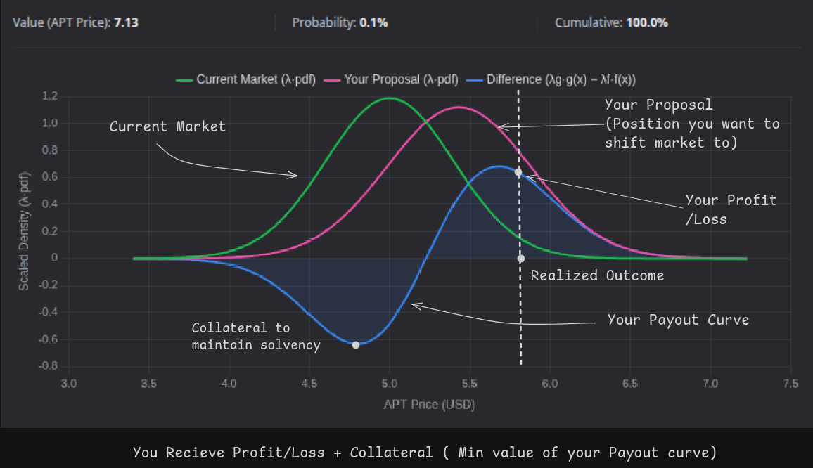
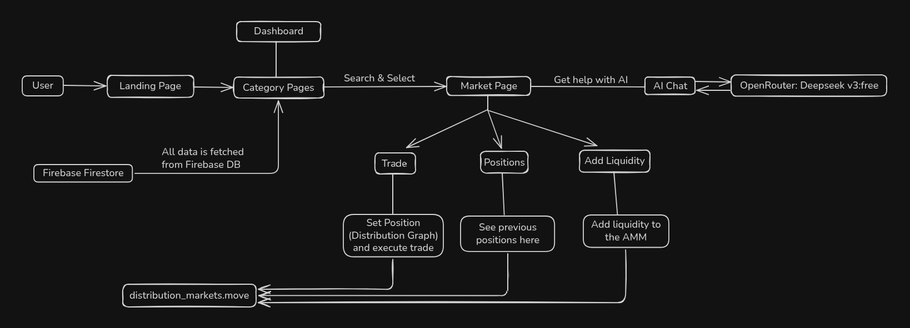

<div align="center">


**Next Generation Prediction Markets Platform on Aptos**

*From risky guesses to informed trades, capture every outcome.*

[](https://opensource.org/licenses/MIT)
[](https://aptoslabs.com/)
[](https://nextjs.org/)
[](https://www.typescriptlang.org/)
[](https://move-language.github.io/)

</div>

---

## 📋 Table of Contents

- [📋 Table of Contents](#-table-of-contents)
- [🚀 Live Application](#-live-application)
- [🧭 User Guide](#-user-guide)
  - [How to Engage with the Market](#how-to-engage-with-the-market)
  - [Profit](#profit)
- [🌟 Overview](#-overview)
  - [🎯 Key Features](#-key-features)
- [🏗️ Architecture](#️-architecture)
- [🚀 Quick Start](#-quick-start)
  - [Prerequisites](#prerequisites)
  - [Installation](#installation)
- [📁 Project Structure](#-project-structure)
- [🔧 Technology Stack](#-technology-stack)
  - [Frontend](#frontend)
  - [Backend](#backend)
  - [Blockchain](#blockchain)
- [🧮 Mathematical Foundation](#-mathematical-foundation)
  - [**Continuous Case Setup**](#continuous-case-setup)
  - [**Normal Distribution Model**](#normal-distribution-model)
  - [**L² Norm of Normal Distribution**](#l-norm-of-normal-distribution)
  - [**Scaling Factor λ**](#scaling-factor-λ)
  - [**Backing (Collateral) Constraint**](#backing-collateral-constraint)
  - [**Trader’s Position and Collateral Requirement**](#traders-position-and-collateral-requirement)
  - [**Key Formulas**](#key-formulas)
  - [**Interpretation**](#interpretation)
- [🧪 Testing Smart Contracts](#-testing-smart-contracts)
- [🔗 Contract Addresses](#-contract-addresses)
- [🙏 Acknowledgments](#-acknowledgments)


---

## 🚀 Live Application


**🔥 Try Infi Markets Now**

[](https://aptos-distribution-markets-wmw5.vercel.app/)

🚨 **Website loading delay**: Render's policy of spinning down free instance with inactivity, can delay website loading by 50 seconds or more.

🚨 **Only Demo available**: Currently, only **Demo** market has been initialized with liquidity.

---

## 🧭 User Guide

### How to Engage with the Market

1. **Select a Market**
2. **Set Your Position:** By changing the following parameters.

   * **Mean:** This represents the <u>expected value of the asset</u> in a market. 
    
        **Example:** for market *What will be price of APT by the end of December 2025*, the mean here is the expected price of APT in USD.
    
   * **Standard Deviation:** This represents your level of <u>confidence</u> in the position. A lower standard deviation indicates greater confidence, which can result in higher potential profits if the market resolves in your favor. Lower standard deviation means pointier the curve around your expected value.

        **Example:** If you expect the price of APT to be $8 by the end of December 2025, you will set the mean to 8. And if you are highly confident that the price will be close to $8, you will assign a lower standard deviation, creating a pointier curve around your predicted value.

3. **Execute Trades:** After setting the mean and standard deviation, users can buy their position based on their prediction. All positions will be visible in the **Positions** section.
4. **Add Liquidity:** Users can also provide liquidity and they recieve a proportional amount of LP shares and market position minted.

### Profit

* You earn based on your payout curve of your position. It's better to understand it visually through the following chart



* Regardless of whether the market resolves in your favor through trade positions, users earn a **4% APY** on their positions.
* Holding LP shares allows you to earn percentage of the fees that the platform is earning. Also you get a position through which you can settle and earn.

---

## 🌟 Overview  

**Infi Markets** is a next generation prediction market platform built on the Aptos blockchain, implementing continuous distribution markets for normal (Gaussian) probability distributions. This project is a implementation of the [Distribution Markets research paper](https://www.paradigm.xyz/2024/12/distribution-markets) by Dave White at Paradigm.

Unlike traditional binary prediction markets, Infi Markets allows traders to express nuanced beliefs about outcomes using distribution curves in virtually infinite ways. This unlocks a new dimension of prediction markets which captures the real world complex events which can't be captured by simple yes or no markets.

### 🎯 Key Features

- **📊 Continuous Distribution Markets**: Trade on normal distributions with infinite possibilities
- **🔗 Aptos Blockchain Integration**: Built on Aptos with Move smart contracts
- **🤖 AI-Powered Insights**: Integrated AI chat for market analysis, to provide guidance and knowledge to users to make smarter positions.
- **🔥 Real-time Data**: Firebase Firestore for market data
- **💼 Wallet Integration**: Seamless Aptos wallet connectivity, using Aptos Labs SDK

## 🏗️ Architecture



## 🚀 Quick Start

### Prerequisites

- **Node.js** >= 18.0.0
- **Aptos CLI** for smart contract deployment
- **Firebase Project** for database
- **OpenAI API Key** for AI features

### Installation

1. **Clone the repository**

```bash
git clone https://github.com/aryanbaranwal001/aptos_distribution_markets.git
cd aptos_distribution_markets
```

2. **Install dependencies**

```bash
# Backend dependencies
cd backend
npm install

# Frontend dependencies
cd ../frontend
npm install

# Smart contracts (optional)
cd ../contracts
aptos move compile
```

  

3. **Environment Setup**

**Backend (.env)**

```bash
FIREBASE_SERVICE_ACCOUNT_KEY=firebase_service_account_key_in_json
PORT=5000
NODE_ENV=development
API_BASE_URL=/api/v1
RATE_LIMIT_WINDOW_MS=900000
RATE_LIMIT_MAX_REQUESTS=100
OPENAI_API_KEY=your_openai_key
```
**Frontend (.env.local)**

```bash
NEXT_PUBLIC_API_BASE_URL=http://localhost:5000/api/v1
```

4. **Seed the Firebase Firestore Database**

```bash
cd backend/scripts
node seedDatabase.js
```

5. **Start the development servers**

```bash
# Terminal 1: Backend
cd backend
npm run dev

# Terminal 2: Frontend
cd frontend
npm run dev
```

## 📁 Project Structure


```
aptos_distribution_markets/

├── 🖥️ frontend/ # Next.js 15 React application
│ ├── src/
│ │ ├── app/ # App router pages
│ │ ├── components/ # Reusable React components
│ │ ├── data/ # Market data and types
│ │ ├── hooks/ # Custom React hooks
│ │ ├── services/ # API services
│ │ ├── store/ # Zustand state management
│ │ └── utils/ # Utility functions
│ └── public/ # Static assets and icons
│
├── 🔧 backend/ # Express.js API server
│ ├── src/
│ │ ├── config/ # Firebase configuration
│ │ ├── controllers/ # API route controllers
│ │ ├── middleware/ # Express middleware
│ │ ├── routes/ # API routes
│ │ └── services/ # Business logic
│ └── scripts/ # Database seeding scripts
│
├── 📜 contracts/                     # Aptos Move smart contracts
│   ├── aptos-aave-v3/                # Aptos Aave v3 submodule
│   ├── distribution_market_v2/       
│   │   └── distribution_markets_v2.move   # Main market contract with Aave integration
│   │
│   ├── sources/                      # Move source files
│   │   ├── distribution_markets.move     # Main market contract
│   │   └── math_utils.move               # State-of-the-art math utils library in Move
│   │
│   └── tests/                         # Contract tests
│
└── 🖼️ README.md # Project README
```

## 🔧 Technology Stack

### Frontend

- **Framework**: Next.js 15 with App Router
- **Language**: TypeScript
- **Styling**: Hybrid of Tailwind CSS and CSS
- **State Management**: Zustand
- **Charts**: Chart.js with React integration
- **3D Graphics**: Three.js
- **Wallet**: Aptos Labs Wallet Adapter

### Backend
- **Runtime**: Node.js with Express.js
- **Database**: Firebase Firestore
- **Authentication**: Firebase Admin SDK
- **Rate Limiting**: Express Rate Limit
- **AI Integration**: OpenAI API
- **Security**: Helmet, CORS

### Blockchain

- **Network**: Aptos Testnet
- **Language**: Move
- **SDK**: Aptos Labs TypeScript SDK
- **Features**: Continuous distribution markets

## 🧮 Mathematical Foundation

Infi Markets implements the **Distribution Markets** protocol based on the [Paradigm research paper](https://www.paradigm.xyz/2024/12/distribution-markets) by **Dave White**.
This research introduces **continuous-outcome prediction markets** using **constant-function AMMs (CFAMMs)** defined over **probability distribution functions**.

The continuous case is modeled using **Normal (Gaussian)** distributions, forming the mathematical core of the system.

---

### **Continuous Case Setup**

Let outcomes lie on the real line $\mathbb{R}$.
Both the AMM and traders hold outcome functions $f(x)$,
where $f(x)$ represents the number of tokens that pay $f({x_0})$ if the realized outcome equals $x_0$.

**Inner product and L² norm:**

* $\langle f, g \rangle = \int_{-\infty}^{\infty} f(x) g(x), dx$
* $|f|^2 = \int_{-\infty}^{\infty} f(x)^2, dx$

The AMM maintains a **constant function invariant:**

$$
|f|^2 = K
$$

where $K$ is the invariant constant defining the CFAMM surface.

---

### **Normal Distribution Model**

Each market position (trader or AMM) is modeled as a **scaled Normal distribution**:

$$
f(x) = \lambda , p_{\mu,\sigma}(x)
$$

where the Normal (Gaussian) probability density function is:

$$
p_{\mu,\sigma}(x) = \frac{1}{\sqrt{2\pi},\sigma} , e^{-\frac{(x-\mu)^2}{2\sigma^2}}
$$

and the parameters are:

| Symbol | Meaning                                     |
| :----: | :------------------------------------------ |
|  **μ** | Mean — central tendency of the distribution |
|  **σ** | Standard deviation — spread and uncertainty |
|  **λ** | Scaling factor to satisfy AMM invariant     |
|  **K** | CFAMM invariant constant                    |

---

### **L² Norm of Normal Distribution**

The squared L² norm of the Normal pdf is given by:

$$
|p_{\mu,\sigma}|^2 = \int_{-\infty}^{\infty} p_{\mu,\sigma}(x)^2, dx
$$

Substituting the pdf expression:

$$
|p_{\mu,\sigma}|^2 = \frac{1}{2\pi\sigma^2} \int_{-\infty}^{\infty} e^{-\frac{(x-\mu)^2}{\sigma^2}}, dx
$$

Using the Gaussian integral
$\int_{-\infty}^{\infty} e^{-a(x-\mu)^2} dx = \sqrt{\frac{\pi}{a}}$ with $a = 1/\sigma^2$, we get:

$$
\boxed{|p_{\mu,\sigma}|^2 = \frac{1}{2\sigma\sqrt{\pi}}}
$$

Hence, the L² norm depends **only on the spread ($\sigma$)** and not on the mean ($\mu$).

---

### **Scaling Factor λ**

To satisfy the AMM invariant $|f|^2 = K$:

$$
|f|^2 = \lambda^2 |p_{\mu,\sigma}|^2 = K
$$

Solving for $\lambda$ gives the closed-form relationship:

$$
\boxed{\lambda = K\sqrt{2\sigma\sqrt{\pi}}}
$$

This links the scaling factor $\lambda$ directly to the invariant $K$ and the standard deviation $\sigma$.

---

### **Backing (Collateral) Constraint**

To maintain solvency, the AMM enforces a **maximum payout cap ($b$):**

$$
f(x) \le b \quad \forall x
$$


---

### **Trader’s Position and Collateral Requirement**

When a trader moves the market from $f(x)$ to $g(x)$:

$$
\pi(x) = g(x) - f(x)
$$

The **collateral required** equals the worst-case loss:

$$
\text{Collateral} = -\min_x \big(g(x) - f(x)\big)
$$

For Gaussian functions, this minimum can be found **numerically**, since the difference of two Gaussian curves is unimodal.

---

### **Key Formulas**

| Concept               | Formula                                                                            |
| :-------------------- | :--------------------------------------------------------------------------------- |
| **Normal PDF**        | $p_{\mu,\sigma}(x) = \frac{1}{\sqrt{2\pi}\sigma} e^{-\frac{(x-\mu)^2}{2\sigma^2}}$ |
| **L² Norm**           | $|p_{\mu,\sigma}|^2 = \frac{1}{2\sigma\sqrt{\pi}}$                                 |
| **Scaling Factor**    | $\lambda = \sqrt{2\sigma\sqrt{\pi},K}$                                             |
| **Capped Function**   | $f_{\text{cap}}(x) = \min(\lambda p_{\mu,\sigma}(x), b)$                           |
| **Invariant**         | $\int f(x)^2 dx = K$                                                               |
| **Trader Collateral** | $\text{Collateral} = -\min_x (g(x) - f(x))$                                        |

---

### **Interpretation**

* **μ (Mean)** → Trader’s directional belief
* **σ (Standard Deviation)** → Trader’s confidence (narrower = higher confidence)
* **λ (Lambda)** → Scales position to preserve the AMM invariant
* **K (Invariant)** → Maintains constant AMM depth and stability
* **b (Cap)** → Limits maximum exposure and ensures solvency

---

## 🧪 Testing Smart Contracts

```bash
cd contracts
aptos move test
```
## 🔗 Contract Addresses

**Contract Address:**  
`0x3b0c1f2a3f9f281f3a654afd1cc07dfcdfa8facee967b196cc77cdd20b98c829`

**Market Address:**  
`0x9670ebf76c115dbaed650267312b69b4ed52cdcba4bb5bc52786c89f65bbc7d2`

## 🙏 Acknowledgments

- **[Dave White at Paradigm](https://www.paradigm.xyz/2024/12/distribution-markets)** for the Distribution Markets research paper
- **Aptos Labs** for the blockchain infrastructure and Move language
- **Next.js Team** for the amazing React framework
- **Firebase** for the real-time database
- **OpenAI** for AI capabilities
- **Paradigm Research Team** for advancing the field of information finance
---

<div align="center">
<p><strong>Built with ❤️ on Aptos</strong></p>
<p>© 2024 Infi Markets. All rights reserved.</p>
</div>